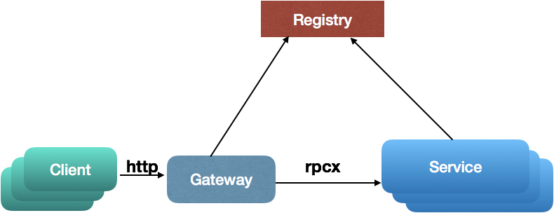
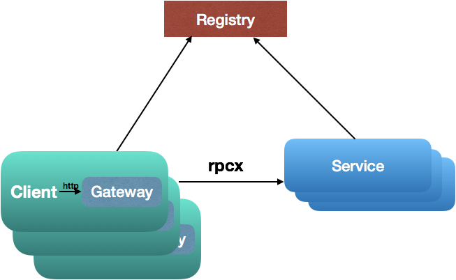

# rpcx-gateway
[rpcx-gateway](https://github.com/rpcxio/rpcx-gateway) is a http gateway for [rpcx](https://github.com/smallnest/rpcx) services.

[rpcx](https://github.com/smallnest/rpcx) is a fast rpc framework. Faster, more features.

You can write rpc http clients in any programming languages such as Java、Python、C#、Node.js、Php、C\C++、Rust and others. See [examples](https://github.com/rpcxio/rpcx-gateway/blob/master/examples/README.md)

## Deployment models

There are two deployment modes: **Gateway** and **Agent**。

### Gateway



You can deploy this as gateway model. Gateway is running at independent servers. Clients sends http requests to gateways, and gateways translate http requests into raw rpcx requests. And then gateways send raw rpcx requests to rpcx services.

when gateways receive rpcx responses, they translates rpcx responses into http responses and return clients.

You can scale gateway easily because it is stateless.

It works like a http load balancer.


### Agent




You can also deploy this as agent model. Agents are deploy with clients. They are installed as a daemon application in node of clients. If there are multiple clients in one node, you only need to install one agent.

Clients send http requests to their local agent. The local agent translate http requests into rpcx requests, send rpcx requests to rpcx services, translate rpcx responses into http ressponses.

It works like service mesh.


## Protocol

You can send a http request in any programming languages. You must set some extra http headers in requests.

- X-RPCX-Version: rpcx version
- X-RPCX-MesssageType: set 0 as request
- X-RPCX-Heartbeat: is heartbeat request or not, false in default.
- X-RPCX-Oneway: is one-way request or not, false in default.
- X-RPCX-SerializeType: 0 as raw bytes, 1 as JSON, 2 as protobuf, 3 as msgpack
- X-RPCX-MessageID: message ID, uint64 type
- X-RPCX-ServicePath: service path
- X-RPCX-ServiceMethod: service method
- X-RPCX-Meta: extra metadata

For the http response, there are some extra http headers:

- X-RPCX-Version: rpcx version
- X-RPCX-MesssageType: 1 as response
- X-RPCX-Heartbeat: is heartbeat response or not
- X-RPCX-MessageStatusType:  Error or Normal. Error means there is call failure
- X-RPCX-SerializeType: 0 as raw bytes, 1 as JSON, 2 as protobuf, 3 as msgpack
- X-RPCX-MessageID: message ID, uint64 type
- X-RPCX-ServicePath: service path
- X-RPCX-ServiceMethod: service method
- X-RPCX-Meta: extra metadata
- X-RPCX-ErrorMessage: error message if X-RPCX-MessageStatusType is Error


## Example

There is a golang http client example:

```go
package main

import (
	"bytes"
	"io/ioutil"
	"log"
	"net/http"

	"github.com/rpcxio/rpcx-gateway"

	"github.com/smallnest/rpcx/codec"
)

type Args struct {
	A int
	B int
}

type Reply struct {
	C int
}

func main() {
	cc := &codec.MsgpackCodec{}

    // request 
	args := &Args{
		A: 10,
		B: 20,
	}
	data, _ := cc.Encode(args)

	req, err := http.NewRequest("POST", "http://127.0.0.1:9981/", bytes.NewReader(data))
	if err != nil {
		log.Fatal("failed to create request: ", err)
		return
    }
    
    // set extra headers
	h := req.Header
	h.Set(gateway.XSerializeType, "3")
	h.Set(gateway.XServicePath, "Arith")
	h.Set(gateway.XServiceMethod, "Mul")

    // send to gateway
	res, err := http.DefaultClient.Do(req)
	if err != nil {
		log.Fatal("failed to call: ", err)
	}
	defer res.Body.Close()

	// handle http response
	replyData, err := ioutil.ReadAll(res.Body)
	if err != nil {
		log.Fatal("failed to read response: ", err)
	}

    // parse reply
	reply := &Reply{}
	err = cc.Decode(replyData, reply)
	if err != nil {
		log.Fatal("failed to decode reply: ", err)
	}

	log.Printf("%d * %d = %d", args.A, args.B, reply.C)
}
```
